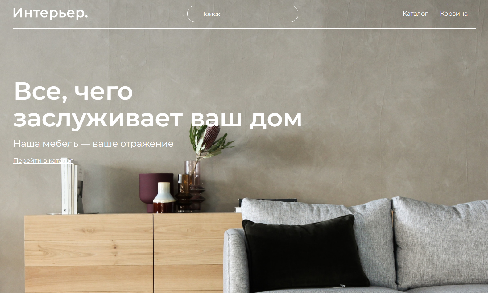
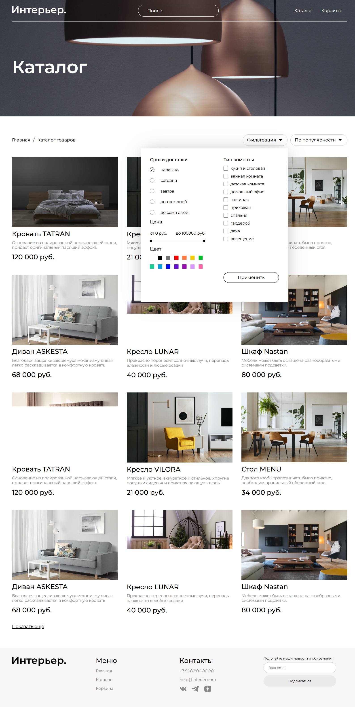
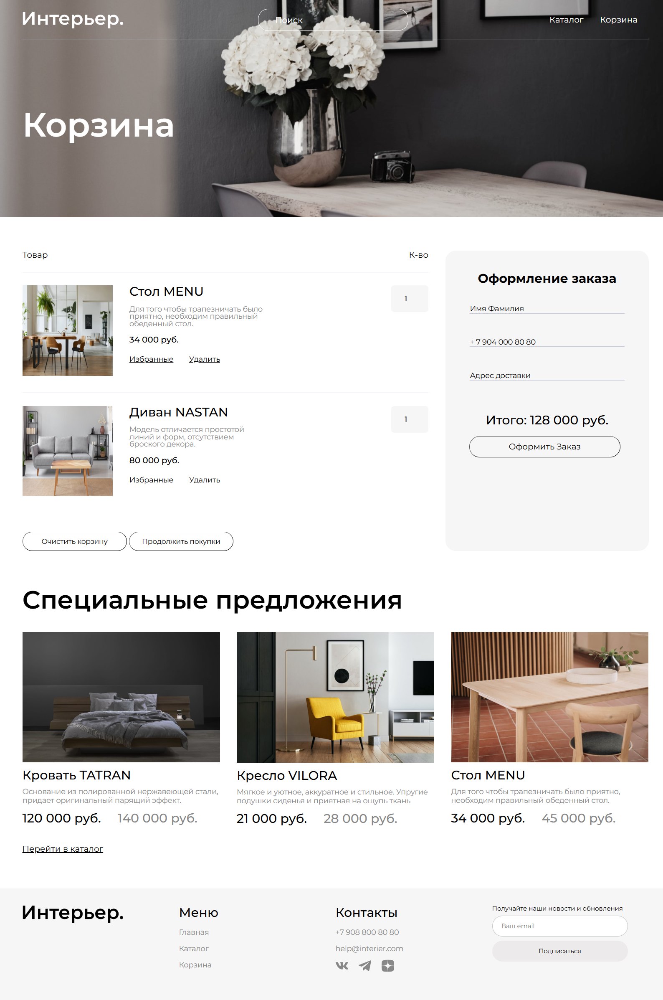

# Furniture Market — Интернет-магазин мебели

## 📌 О проекте
Furniture Market — это многостраничный сайт интернет-магазина мебели с каталогом товаров, фильтрацией и корзиной. Проект демонстрирует навыки современной адаптивной верстки и организацию кода с использованием препроцессора SASS.

**Основные страницы:**
- Главная с промо-блоком и специальными предложениями
- Каталог товаров с системой фильтрации
- Корзина с оформлением заказа

## 🔗 Ссылки
- **Репозиторий:** (https://github.com/jteterev/furniture)
- **Демо:** (https://jteterev.github.io/furniture/)

## 🛠 Технологии
- **Верстка:** HTML5 (семантическая)
- **Стилизация:** CSS3 / SASS (SCSS) — переменные, вложенность, миксины, паршалы
- **Методология:** БЭМ (классы вида `block__element_modifier`)
- **Адаптивность:** Desktop-first, 3 брейкпоинта (десктоп, планшет, мобильные)
- **Графика:** SVG-иконки, оптимизированные изображения

## ✨ Что реализовано

### Общее
- [x] Единый стиль для всех страниц
- [x] Адаптивная верстка для всех устройств (мобильные, планшеты, десктоп)
- [x] Семантическая верстка с использованием header, section, article, footer
- [x] БЭМ-именование для масштабируемости кода

### Главная страница (index.html)
- [x] Шапка с логотипом, поиском и навигацией
- [x] Hero-блок с призывом к действию
- [x] Сетка категорий "Мебель для ..." (нестандартное grid-расположение)
- [x] Блок специальных предложений с карточками товаров
- [x] Каталог товаров на главной
- [x] Footer с формой подписки и контактами

### Каталог (catalog.html)
- [x] Хлебные крошки для навигации
- [x] Выпадающая форма фильтрации с:
  - Радиокнопками для сроков доставки
  - Двойным слайдером для выбора цены
  - Сеткой цветов с кастомным отображением
  - Чекбоксами для типов комнат
- [x] Кнопка применения фильтров
- [x] Сетка карточек товаров (по 3 в ряд на десктопе)

### Корзина (cart.html)
- [x] Список добавленных товаров с изображениями
- [x] Редактирование количества товаров
- [x] Ссылки "Избранные" и "Удалить"
- [x] Кнопки управления корзиной
- [x] Форма оформления заказа с полями
- [x] Автоматический подсчет итоговой суммы
- [x] Анимированная кнопка оформления (пульсация)

### Особенности верстки
- **SASS-архитектура:** основной файл style.scss импортирует паршалы (cart.scss, mobile.scss, tablet.scss)
- **Переменные:** цвета, шрифты вынесены в переменные для легкой кастомизации
- **Миксины:** переиспользуемые блоки кода
- **Кастомные элементы:** стилизованные чекбоксы, радиокнопки, цветовые свачи
- **Анимации:** hover-эффекты, появление кнопок действий при наведении на карточку

- ## 📸 Скриншоты

### Главная страница

### Каталог с фильтрами

### Корзина

## 🚀 Моя роль
Я выполнил полный цикл разработки:
1. Верстка всех страниц по макету (или собственной структуре)
2. Организация SASS-архитектуры с разделением на компоненты
3. Реализация сложных UI-элементов (кастомные фильтры, слайдер цен, цветовые свачи)
4. Адаптация под все устройства
5. Создание интерактивных элементов на чистом CSS (без JS)

## 💡 Особенности проекта
- **Сложная фильтрация:** реализован двойной ползунок для выбора диапазона цен с синхронизацией значений
- **Кастомные элементы форм:** все чекбоксы, радиокнопки и цветовые индикаторы стилизованы с сохранением доступности
- **Grid-сетка категорий:** нестандартное расположение блоков на главной (один элемент занимает 6 колонок, другие по 4)
- **SASS-переменные:** вся цветовая схема и шрифты управляются через переменные — можно изменить тему в одном месте
- **Адаптивность без JS:** все адаптивные решения реализованы только на медиа-запросах
